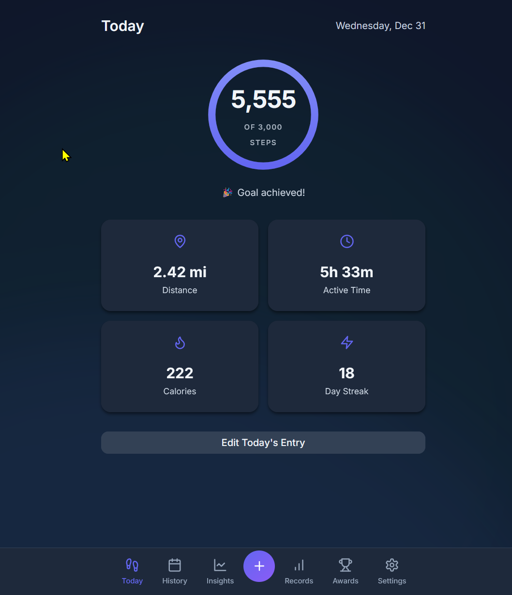
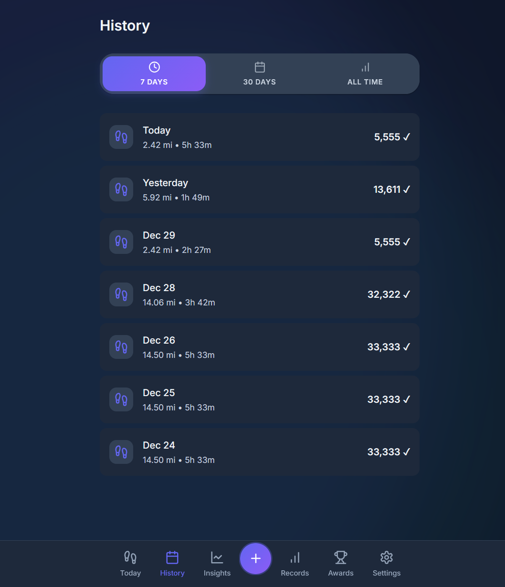
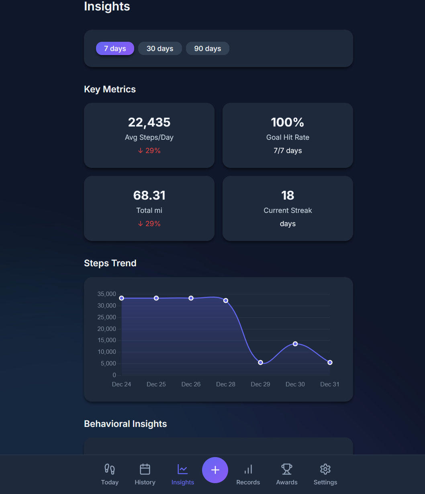
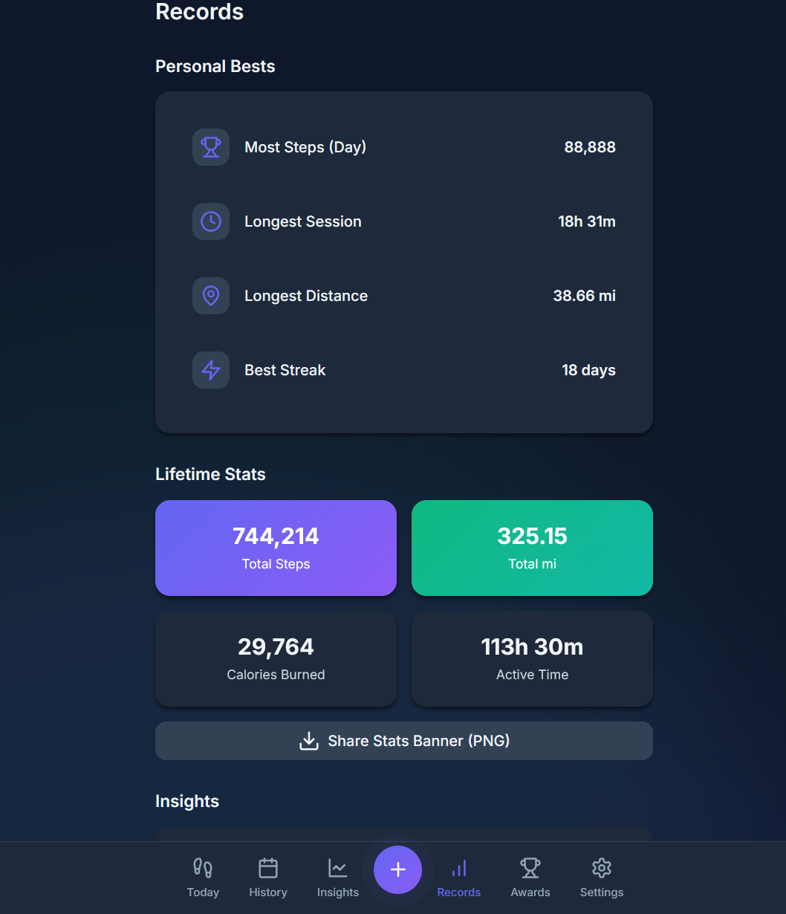
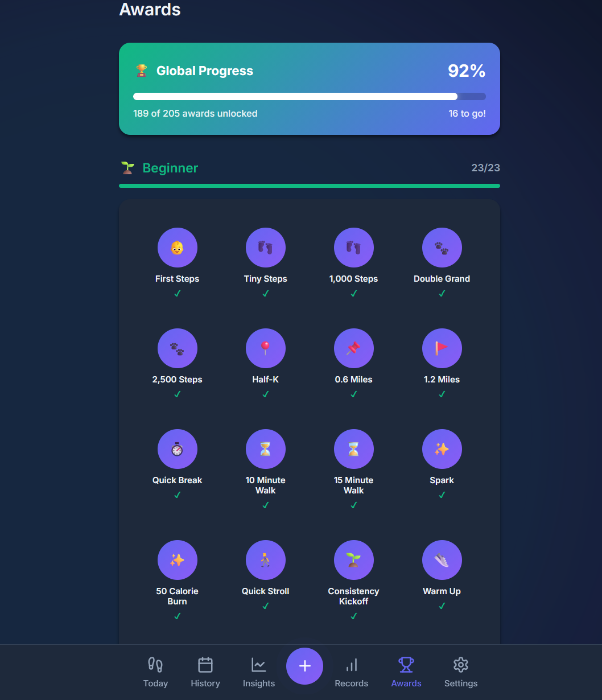
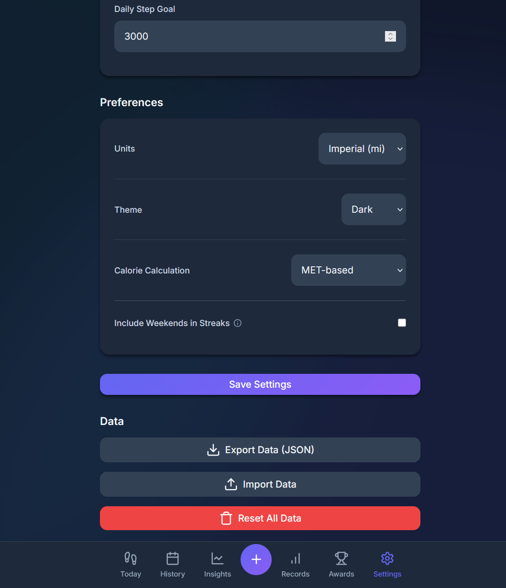
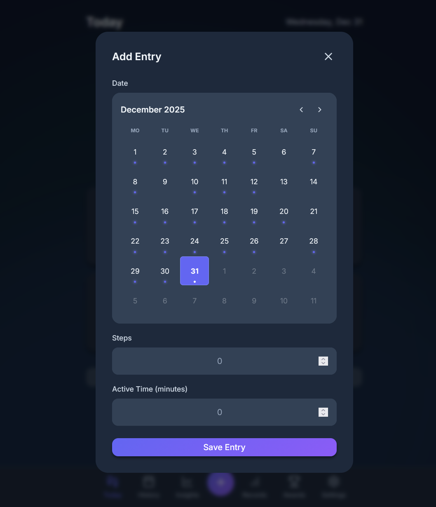

# Steps Tracker

https://commanderfoo.github.io/steps-tracker/

A web application for manually tracking your daily walking activity.

## Overview

Steps Tracker allows you to manually log your daily steps, calculating distance and calories automatically. It features a gamified experience with streaks, awards, and visualizations to help you stay motivated—all without requiring a backend, login, or internet connection.

Useful for those who don't have a fitness tracker or want to track their steps manually.

## Features

- **Privacy Focused**: All data is stored locally in your browser (LocalStorage).
- **Manual Tracking**: Log steps, active time, and date.
- **Auto-Calculations**: Automatically estimates distance (km/mi) and calories burned based on your personal settings (height/weight).
- **Gamification**:
  - **Streaks**: Track your daily consistency (with optional weekend exclusion).
  - **Awards**: Unlock over 60 milestones for steps, distance, calories, and streaks.
  - **Progress Tracking**: Visualize your journey with global and category-specific progress bars.
- **Visualizations**:
  - Daily progress ring.
  - Charts for Weekly, Monthly, and Yearly trends.
- **Export**:
  - Generate shareable "Banner" images of your stats.
  - Export/Import data as JSON for backup (with reminder for weekly backup).
- **Customizable**:
  - Dark/Light mode support.
  - Metric/Imperial unit toggle.

## Images

## License

MIT License - See [LICENSE](LICENSE) file for details.
